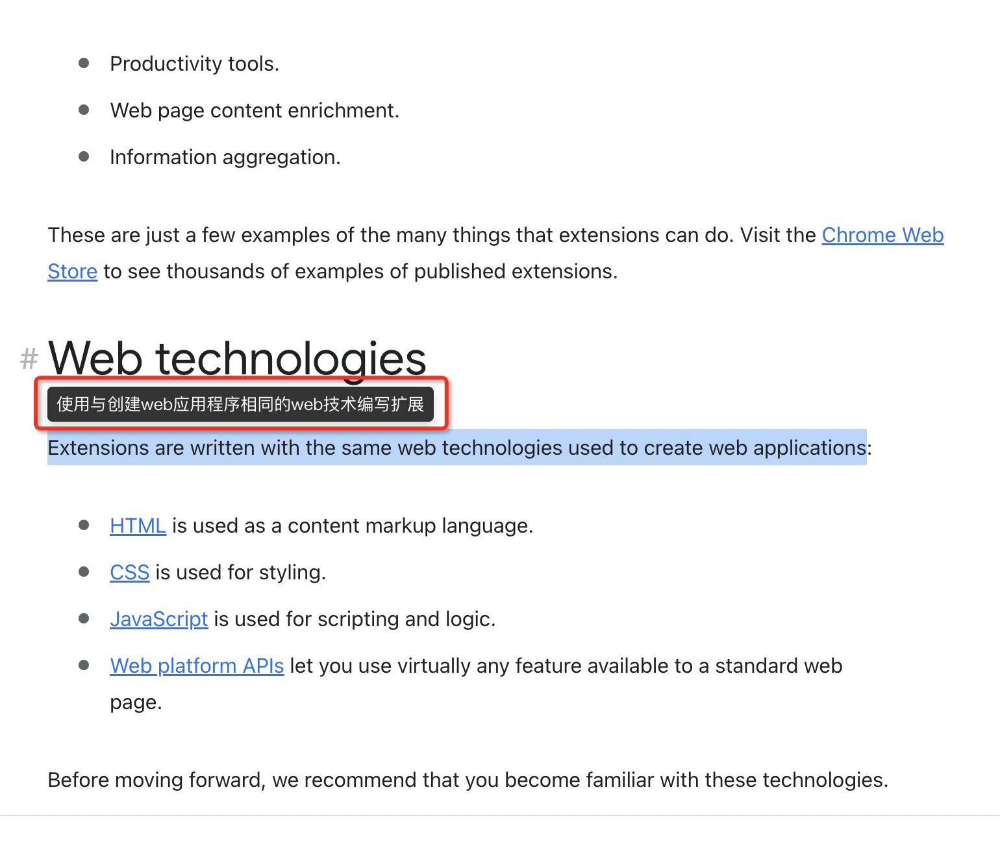
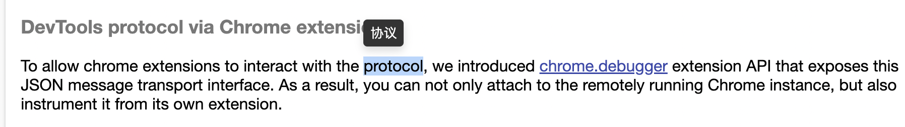

### translate-chrome-plugin

> 基于webpack5的 chrome 插件基础项目 - 顺滑的划词翻译

### Technology Stack

- 🔥 `webpack5`、`webpack-cli`,`webpack-dev-server`
- 🔥 `react`, `react-router`,`typescript`
- 🔥`babel`,`typescript`、`tailwindcss`, `sass`
- ...

### Run

- clone

```bash
  git clone git@github.com:lnp1996/translate-chrome-plugin.git
```

- cd

```bash
  cd translate-chrome-plugin
```

- install

```bash
  npm i
  // or
  pnpm i
  // or
  yarn i
```

- 编辑器中全局搜索"TODO"（其实就是到 src/pages/content/index.js 中），修改自己的appID 以及密钥。
- 然后打包、浏览器加载dist/base-chrome-plugin 文件夹即可
- 目前支持：百度翻译引擎。 英文 => 中文
- API appid申请地址： https://fanyi-api.baidu.com/api/trans/product/desktop?req=detail
- 自己注册一个appID，每月200万字符免费，自用够了。

- 打包运行插件,生成插件`manifest.json`包

```bash
npm run build
// or
pnpm run build
```

- 浏览器输入`chrome://extensions`or `扩展程序>管理扩展程序>加载已解压的扩展程序`>加载含有`manifest.json`文件夹

### Environments

- dev

```bash
  npm run build:dev
  // or
  pnpm run build:dev
```

- test

```bash
  npm run build:test
  // or
  pnpm run build:test
```

- prod

```bash
  npm run build
  // or
  pnpm run build
```

### View

- 选择文本，则会在文本上方出现对应翻译




### Finally

- 如果看完项目，觉得有所收获或帮助，就不要吝啬给个`star`鼓励下作者吧~
- don't hesitate to give a 'star' to encourage the author~
